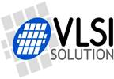

# Yeshere.cn
The official website for Yeshere company, the China agent for VLSI in Finland

深圳市源合汇通科技有限公司（YesHere Technology Limited）成立于2001年，专注于音频产品供应，VLSI 音频产品一级授权代理商，也是唯一的中国大陆本土代理商。
公司有着数十年的世界各大电子元器件配套分销经验，为您提供尽可能的一站式采购平台。
公司总部位于深圳，在上海，北京设有服务处，营销和售后网络遍布全国。

VLSI，创立于1991年，是一家创新型超大规模集成电路的设计、研发、制造公司，总部位于芬兰。

VLSI在创造独特的信号处理解决方案上实力强大，一半的员工在进行研究与开发(R&D)，他们创造并完全控制自己的设计和研发，公司的研究重点是低功耗应用的数模混合信号与射频信号。近年来业绩持续大幅度增长，市场份额不断扩大。

2011年，VLSI与深圳市源合汇通科技有限公司科技有限公司（YesHere Technology Ltd.）达成代理协议，授权其成为中国大陆唯一代理商，进一步拓展中国大陆市场.

